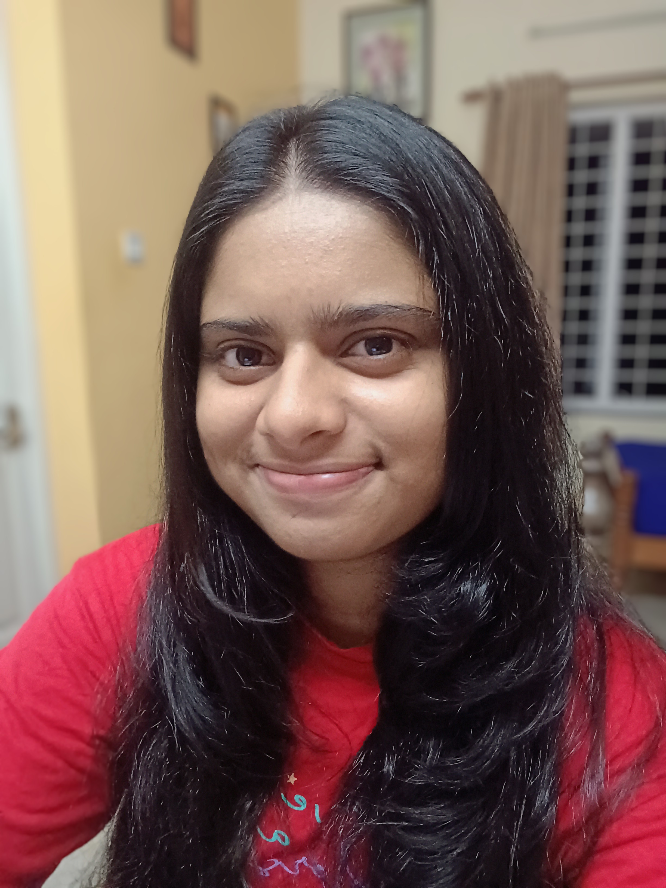

# 👋 Welcome


**About this Site: This is developed to help KTU Students find all resources in one place.**



[Broken link](/broken/pages/cxXS7COrfZEFL2CGAzDJ)



[Broken link](/broken/pages/nNcp5fhFYjKAbZjf071L)


## Contribution Guidelines

**Contributing with PDFs/PPTs**

For example, if you want to contribute to **S5 -> Computer Networks -> Module 1**, follow these steps:

1. Send an edit request to this [folder](https://drive.google.com/drive/folders/1OAoxDY5tkeUGZHzT4uw4dZTuRtjBsZQh?usp=sharing)
2. Create a new folder with \<your full name> in it.
3. There is a [sample folder](https://drive.google.com/drive/folders/1OAoxDY5tkeUGZHzT4uw4dZTuRtjBsZQh?usp=sharing) inside which contains sample submission on how to contribute pdf files and textbooks.&#x20;

**Contributing Text Content**

If you want to contribute text content, such as writing about **ER Diagrams in Module 1 of DBMS**:

1. Create a PR and navigate to the **DBMS** section of **S4**.
2. If the "Module 1" folder doesn't exist, create it.
3. Add your content under the "ER Diagram" section of Module 1.
4. Feel free to attach YouTube links and other resources that you believe will be beneficial to others.

We appreciate your efforts to improve our site and look forward to your contributions!

## Contributors

<figure><figcaption>
<strong>Karthik G Kumar</strong>  <strong>✉️ karthikgkumar.pro@gmail.com ▶</strong><a href="https://www.linkedin.com/in/karthik-g-kumar"><strong>Linkedin</strong></a> 
</figcaption></figure>

<figure><figcaption>
<strong>Varsha Thomas</strong> <strong>✉️ varshathomas364@gmail.com ▶</strong><a href="https://www.linkedin.com/in/varsha-thomas-6b6530255/"> <strong>Linkedin</strong></a> 
</figcaption></figure>

<figure><figcaption>
<strong>John Bethlehem Pallan</strong>  <strong>✉️ bethlehempallan10gmail.com ▶</strong><a href="https://www.linkedin.com/in/johnbethlehempallan/"><strong>Linkedin</strong></a> 
</figcaption></figure>

